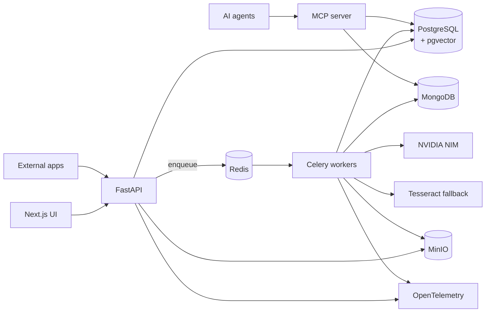

# IPA — Intelligent Process Automation for Documents

Ingest documents via UI or API, decompose them to page images, OCR them, extract
structured JSON against user-defined schemas, embed them for retrieval, route them
through human validation, and expose the whole corpus to AI agents over MCP.

> **Status:** design complete, implementation in progress. See
> [`docs/02-task-plan.md`](docs/02-task-plan.md) for the build order.

## What it does

| Capability | How |
| --- | --- |
| Upload files to blob storage | MinIO, content-addressed by SHA-256 |
| Structured data | PostgreSQL — users, tags, schemas, document metadata, per-step state |
| Document content | MongoDB — OCR text and versioned extracted JSON |
| OCR + structured extraction | NVIDIA NIM (VLM + LLM), native PDF text layer first, Tesseract fallback |
| Split / decompose | PDF and ZIP → PNG/JPEG pages; archives fan out into child documents |
| Vector search | pgvector in PostgreSQL, hybrid dense + full-text with RRF fusion |
| Caching | Redis — extraction JSON, tag schemas, search results, idempotency, locks |
| Per-step state | `document_steps` table, one row per step, reprocessable from any point |
| Logging + tracing | structlog JSON + OpenTelemetry across API, worker, and providers |
| Ingestion via UI and API | Next.js frontend and a documented REST API with webhooks |
| Agent access | MCP server over Streamable HTTP with cited, bounded results |

## Architecture



Full detail in [`docs/00-architecture.md`](docs/00-architecture.md).

## Pipeline

```text
store → decompose → ocr → extract → embed → review
```

Every step persists its own state, attempt count, timings, and errors. Any step can
be reprocessed independently, which resets it and everything downstream.

## Quickstart

```bash
cp .env.example .env          # fill in NVIDIA_API_KEY and the three model IDs
make up                       # postgres, mongo, redis, minio, otel, api, worker
make migrate
make seed                     # bootstrap admin + example tags + sample documents
open http://localhost:3000
```

## Key design decisions

- **PostgreSQL is the only source of truth for state.** MongoDB, MinIO, Redis, and
  the vector index are all derivable and rebuildable.
- **Human validation is the default.** A tag's `auto_approve_threshold` is `NULL`
  until someone deliberately sets it, meaning every document of that tag is reviewed.
- **Extractions are append-only.** Corrections create a new version; history is never
  destroyed.
- **Tags are the schema.** Users define document types and typed fields in the UI;
  the JSON Schema handed to the model is compiled from them and versioned.
- **Cheapest OCR that works.** Native PDF text layer costs nothing and is tried first;
  the VLM handles scans; Tesseract catches provider failures.
- **Hybrid retrieval.** Invoice numbers are lexical, questions are semantic — run both
  and fuse with RRF.

## Documentation

| Document | Contents |
| --- | --- |
| [`docs/00-architecture.md`](docs/00-architecture.md) | Components, stores, pipeline, provider strategy |
| [`docs/01-conventions.md`](docs/01-conventions.md) | Repo layout, file ownership, shared contracts, coding rules |
| [`docs/02-task-plan.md`](docs/02-task-plan.md) | 19 tasks in 7 waves with the dependency graph |
| [`docs/tasks/`](docs/tasks/) | One detailed brief per task |

## Development

```bash
make lint typecheck test       # fast, no services required
make test-integration          # full stack against docker-compose.test.yml
make up && make logs
```

Contributions follow the ownership map in `docs/01-conventions.md` — each task owns a
disjoint set of paths so parallel work merges cleanly.
