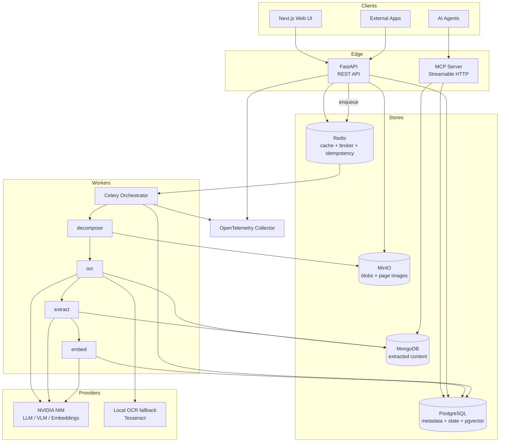
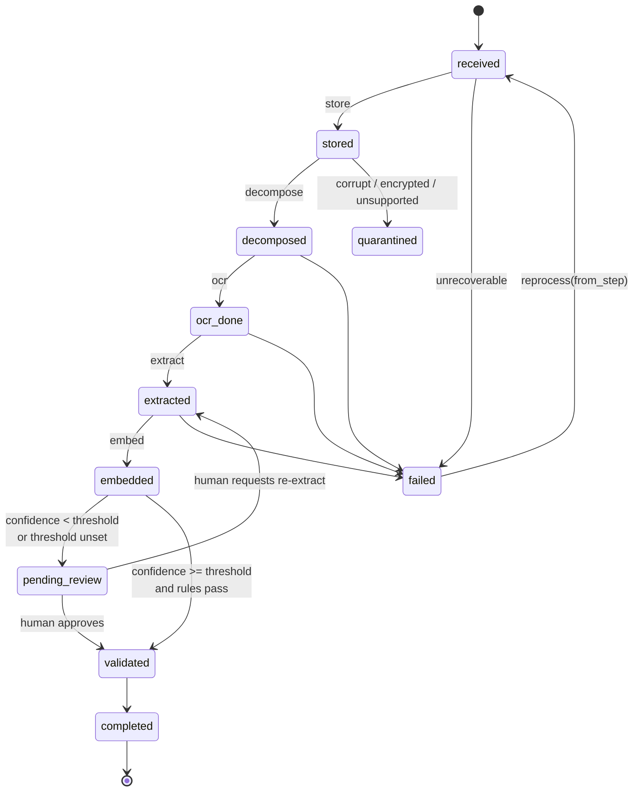

# IPA — Architecture

Intelligent Process Automation platform for documents. Single tenant.

## Purpose

Ingest documents (UI or API) → store in blob → decompose to page images → OCR →
extract structured JSON against a user-defined schema → embed into a vector index →
route to human validation → expose to other agents via MCP/RAG.

## Component map

## Store ownership

PostgreSQL is the **single source of truth for state**. Everything else is derivable
and rebuildable from MinIO + PostgreSQL.

| Store | Owns | Never stores |
| --- | --- | --- |
| PostgreSQL | Users, tags, tag fields, documents metadata, per-step state, events, validations, chunks + embeddings (pgvector) | Raw file bytes, extracted content bodies |
| MongoDB | OCR text per page, extracted JSON documents, versioned | State, ownership, schemas |
| MinIO | Original uploads (content-addressed), rendered page images, thumbnails | Anything queryable |
| Redis | Celery broker/result, cached extraction JSON, cached tag schemas, idempotency keys, distributed locks | Durable state |

## Pipeline

Steps are a fixed ordered enum. Each document has one `document_steps` row per step.

### Step enum

`store` → `decompose` → `ocr` → `extract` → `embed` → `review`

### Per-step status enum

`pending` | `running` | `succeeded` | `failed` | `skipped`

### Document status enum (coarse, derived)

`received` | `processing` | `pending_review` | `validated` | `completed` |
`failed` | `quarantined`

## Key domain rules

1. **Idempotent uploads.** SHA-256 of file bytes is the blob key. A re-upload of the
   same bytes returns the existing `document_id` with `deduplicated: true`. The
   `Idempotency-Key` header additionally dedupes retries of the same HTTP request.
2. **Tag = document type = schema.** A tag owns an ordered list of typed fields.
   The JSON Schema handed to the LLM is generated from those fields. Tags are
   versioned; every extraction records `tag_id` + `tag_version`.
3. **Human validation by default.** `tags.auto_approve_threshold` is nullable and
   defaults to `NULL`, meaning *every* document of that tag goes to human review.
   When set (0.0–1.0), a document auto-validates only if document confidence ≥
   threshold **and** all required fields are present **and** all field validation
   rules pass.
4. **Extractions are append-only.** Never update an extraction row; insert a new
   version. Human corrections create a new version with `source = 'human'`.
5. **Reprocess from any step.** `POST /v1/documents/{id}/reprocess {from_step}`
   resets that step and all downstream steps to `pending` and re-enqueues.
6. **Everything downstream of the blob is rebuildable.** Deleting Mongo or the
   `chunks` table must be recoverable by a full reprocess.

## Provider layer

NVIDIA NIM exposes an OpenAI-compatible API. We use the `openai` Python SDK with
`base_url = NVIDIA_BASE_URL`.

| Capability | Interface | Primary | Fallback |
| --- | --- | --- | --- |
| Chat / extraction | `LlmProvider` | NVIDIA text LLM | none (fail step) |
| Vision OCR | `OcrProvider` | NVIDIA VLM on page image | local Tesseract |
| Native text | `OcrProvider` | PyMuPDF text layer (tried first, no API call) | — |
| Embeddings | `EmbeddingProvider` | NVIDIA embedding model | none (fail step) |

OCR resolution order per page: **native text layer → NVIDIA VLM → Tesseract**.
A page is considered to have a usable text layer if extracted text length ≥
`OCR_TEXT_LAYER_MIN_CHARS` and the alphanumeric ratio is above a threshold.

Every vector row records `embed_model` and `embed_dim` so models can be migrated
side by side.

## Observability

OpenTelemetry traces + metrics + structured JSON logs (`structlog`). A `trace_id`
is generated at upload and propagated through Celery task headers so a whole
document journey is one trace. Instrumented: FastAPI, SQLAlchemy, Redis, Celery,
httpx (provider calls).

## Testing scope

Per the project decision: **no model-accuracy evaluation.** Tests cover plumbing
only — upload correctness, dedupe, state transitions, retries, adapter behaviour,
API contracts, and that each pipeline step runs and persists what it claims.
Provider calls are mocked in unit tests and exercised against real services only in
the optional integration suite.
