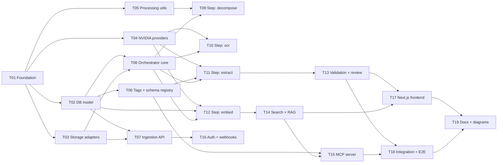

# IPA — Task Plan (wave-based, parallel-agent friendly)

19 tasks in 7 waves. Tasks **inside** a wave have no shared files and no code
dependency on each other — run them as parallel agents. Tasks in wave N may import
anything produced in waves < N.

Every agent must read `docs/00-architecture.md` and `docs/01-conventions.md` first,
then its own `docs/tasks/T##-*.md`.

## Dependency graph

## Waves

| Wave | Parallel agents | Tasks |
| --- | --- | --- |
| 0 | 1 (must run alone) | T01 |
| 1 | 4 | T02, T03, T04, T05 |
| 2 | 3 | T06, T07, T08 |
| 3 | 4 | T09, T10, T11, T12 |
| 4 | 4 | T13, T14, T15, T16 |
| 5 | 2 | T17, T18 |
| 6 | 1 | T19 |

`T17` (frontend) may be started early — as soon as wave 2 lands the OpenAPI schema
is stable enough to scaffold against. It just cannot be *finished* until wave 4.

## Task index

| ID | Title | Wave | Owns |
| --- | --- | --- | --- |
| T01 | Foundation: repo, compose, config, contracts, OTel | 0 | `core/`, `contracts/`, infra files |
| T02 | PostgreSQL data model + Alembic migrations | 1 | `db/`, `migrations/` |
| T03 | Storage adapters: MinIO, MongoDB, Redis | 1 | `storage/` |
| T04 | NVIDIA providers + local OCR fallback | 1 | `providers/` |
| T05 | Processing utilities: PDF, ZIP, images, chunking | 1 | `processing/` |
| T06 | Tags + schema registry service and API | 2 | `domain/tags.py`, `api/routers/tags.py` |
| T07 | Ingestion API: upload, dedupe, status, download | 2 | `domain/documents.py`, `api/routers/documents.py` |
| T08 | Pipeline orchestrator core + reprocessing | 2 | `pipeline/` |
| T09 | Pipeline step: decompose (PDF/ZIP → PNG/JPEG) | 3 | `pipeline/steps/decompose.py` |
| T10 | Pipeline step: OCR with fallback chain | 3 | `pipeline/steps/ocr.py` |
| T11 | Pipeline step: structured extraction + confidence | 3 | `pipeline/steps/extract.py` |
| T12 | Pipeline step: chunk + embed into pgvector | 3 | `pipeline/steps/embed.py` |
| T13 | Validation rules + human review service and API | 4 | `domain/validation.py`, `api/routers/review.py` |
| T14 | Hybrid search + RAG API | 4 | `domain/search.py`, `api/routers/search.py` |
| T15 | MCP server for agent access | 4 | `mcp/` |
| T16 | Auth (API keys + JWT) and webhooks | 4 | `api/auth.py`, `domain/webhooks.py` |
| T17 | Next.js frontend | 5 | `apps/web/` |
| T18 | Integration + E2E tests, seed data | 5 | `tests/integration/` |
| T19 | Generated documentation + mermaid diagrams | 6 | `docs/` |

## How to run a wave with parallel agents

Give each agent exactly one task file and this instruction:

> Read `docs/00-architecture.md`, `docs/01-conventions.md`, and `docs/tasks/T##-*.md`.
> Implement only what T## specifies. Do not modify files owned by other tasks —
> if you need a change there, add a `TODO(T##)` note in your task's README section
> and work around it with the documented contract. Finish with
> `make lint typecheck test` green.

Work each agent in its own git worktree at
`~/dev/worktrees/ipa/<branch>` on branch `feat/t##-<slug>`, then merge in wave order.
